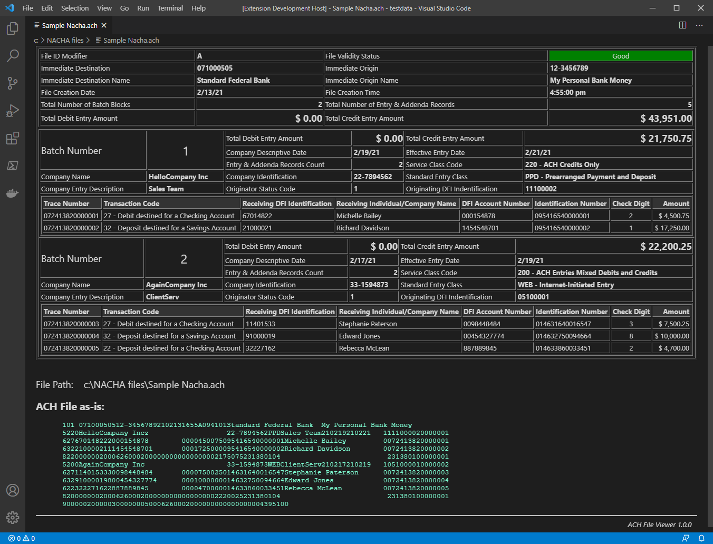

# nacha-viewer README

This is Visual Studio Code extention for viewing ACH files (NACHA files) in  human-comprehendable arrangement.

## Features

- Simple to use and visualize the information inside ACH file.
- Simple file level validations of file structure
- Comprehensive view of dollar amounts and related information

## Requirements

Visual Studio Code - latest version

## Release Notes
This is the first cut of ACH file viewer. Please send your suggestions/enhancement requests to msuresh007@hotmail.com 
### 1.0.0

 - Initial release of ACH File Viewer. 
 - Support for viewing batch records, amounts and associated details

### Future versions
- Inclusion of Addenda rows
- Validation of Dollar amounts 

## License

MIT

## Author 

Suresh Madadha - msuresh007@hotmail.com 

